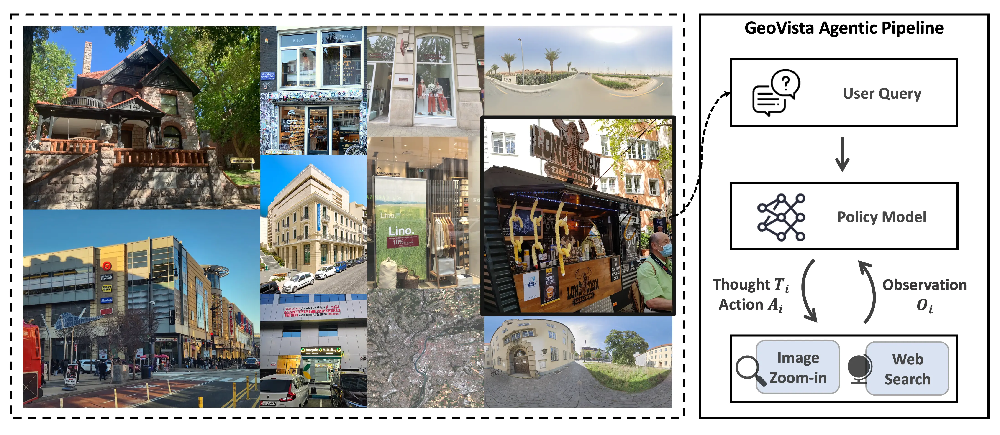
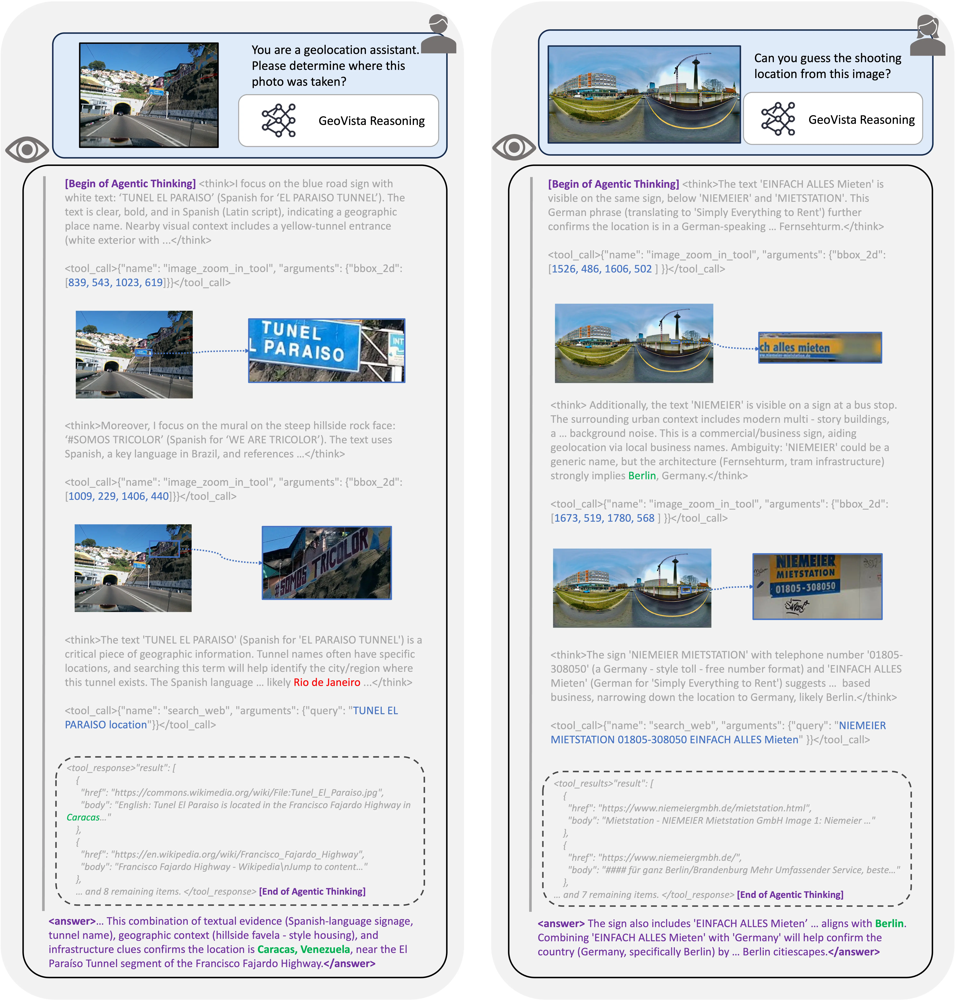
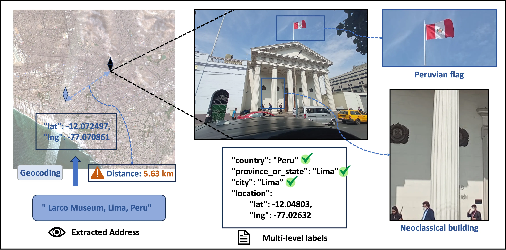
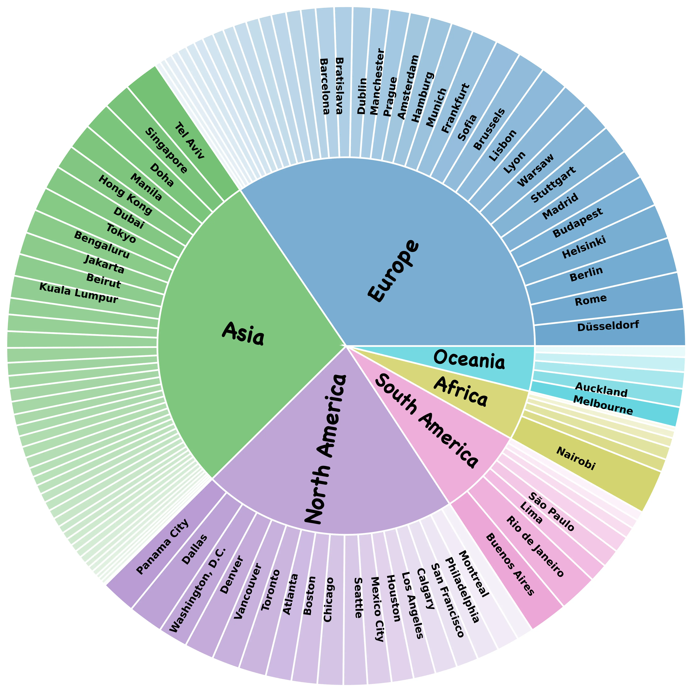

<!--  -->



# GeoVista: Web-Augmented Agentic Visual Reasoning for Geolocalization

<!-- <div align="center">
[💻 Code](https://github.com/ekonwang/GeoVista) | 📃 Paper | [🤗 GeoVista-RL-6k-7B](https://huggingface.co/LibraTree/GeoVista-RL-6k-7B)
</div> -->

<div align="center">
<a href="https://github.com/ekonwang/GeoVista">💻 Code</a> | 📃 Paper | <a href="https://huggingface.co/LibraTree/GeoVista-RL-6k-7B">🤗 GeoVista-RL-6k-7B</a> | <a href="https://huggingface.co/datasets/LibraTree/GeoBench">🤗 GeoVista-Bench (GeoBench)</a> | <a href="https://ekonwang.github.io/geo-vista/"> Project Page</a>
</div>

## Quick Start

1. Setup the environment:
```bash
conda create -n geo-vista python==3.10 -y
conda activate geo-vista

bash setup.sh
```

2. Set up web search API key

We use [Tavily](https://www.tavily.com/) during inference and training. You can sign up for a free account and get your Tavily API key, and then update the `TAVILY_API_KEY` variable of the `.env` file.

```bash
# test web search API key
bash examples/search_test.sh
```

3. Download the pre-trained model and deploy with vllm

from [HuggingFace](https://huggingface.co/LibraTree/GeoVista-RL-6k-7B), place it in the `./.temp/checkpoints/LibraTree/GeoVista-RL-6k-7B` directory.

```bash
python3 scripts/download_hf.py \
--model LibraTree/GeoVista-RL-6k-7B \
--local_model_dir .temp/checkpoints/
```

then deploy the GeoVista model with vllm:

```bash
bash inference/vllm_deploy_geovista_rl_6k.sh
```



4. Run an example inference

```bash
python examples/example.py \
--multimodal_input examples/geobench-example.png \
--question "Please analyze where is the place."
```

You will see the model's thinking trajectory and final answer in the console output.


## Benchmark



- We have already released the [GeoVista-Bench (GeoBench)](https://huggingface.co/datasets/LibraTree/GeoBench) Dataset on HuggingFace 🤗, a benchmark that includes photos and panoramas from around the world, along with a subset of satellite images of different cities to rigorously evaluate the geolocalization ability of agentic models.

<!--  -->

<p align="center">
  
</p>

> GeoBench is the first high-resolution, multi-source, globally annotated dataset to evaluate agentic models’ general geolocalization ability.

- We assess other geolocalization benchmarks with ours along five axes: **Global Coverage (GC)**, indicating whether images span diverse regions worldwide; **Reasonable Localizability (RC)**, measuring whether non-localizable or trivially localizable images are filtered out to preserve meaningful difficulty; **High Resolution (HR)**, requiring all images to have at least $1~\mathrm{M}$ pixels for reliable visual clue extraction; **Data Variety (DV)**, capturing whether multiple image modalities or sources are included to test generalization; and **Nuanced Evaluation (NE)**, which checks whether precise coordinates are available to enable fine-grained distance-based metrics such as haversine distance gap.


| **Benchmark** | **Year** | **GC** | **RC** | **HR** | **DV** | **NE** |
|--------------|---------:|:------:|:------:|:------:|:------:|:------:|
| **[Im2GPS](https://doi.org/10.1109/CVPR.2008.4587784)** | 2008 | ✓ |  |  |  |  |
| **[YFCC4k](https://arxiv.org/abs/1705.04838)** | 2017 | ✓ |  |  |  |  |
| **[Google Landmarks v2](https://arxiv.org/abs/2004.01804)** | 2020 | ✓ |  |  |  |  |
| **[VIGOR](https://arxiv.org/abs/2011.12172)** | 2022 |  |  |  | ✓ |  |
| **[OSV-5M](https://arxiv.org/abs/2404.18873)** | 2024 | ✓ | ✓ |  |  | ✓ |
| **[GeoComp](https://doi.org/10.48550/arXiv.2502.13759)** | 2025 | ✓ | ✓ |  |  | ✓ |
| **GeoBench (ours)** | 2025 | ✓ | ✓ | ✓ | ✓ | ✓ |


## Inference and Evaluation on GeoBench

We provide the whole inference and evaluation pipeline for GeoVista on GeoBench.

### Inference

- Download the GeoBench dataset from [HuggingFace](https://huggingface.co/datasets/LibraTree/GeoBench) and place it in the `./.temp/datasets` directory.

```bash
python3 scripts/download_hf.py \
--dataset LibraTree/GeoBench \
--local_dataset_dir ./.temp/datasets
```

- Download the pre-trained model from [HuggingFace](https://huggingface.co/LibraTree/GeoVista-RL-12k-7B) and place it in the `./.temp/checkpoints` directory.

```bash
python3 scripts/download_hf.py \
--model LibraTree/GeoVista-RL-12k-7B \
--local_model_dir .temp/checkpoints/
```

- Deploy the GeoVista model with vllm:

```bash
bash inference/vllm_deploy.sh
```

- Configure the settings including the output directory, run the inference script:

```bash
bash inference/run_inference.sh
```

After running the above commands, you should be able to see the inference results in the specified output directory, e.g., `./.temp/outputs/geobench/geovista-rl-12k-7b/`, which contains the `inference_<timestamp>.jsonl` file with the inference results.


### Evaluation

- After obtaining the inference results, you can evaluate the geolocalization performance using the evaluation script:

```bash
MODEL_NAME=geovista-rl-12k-7b
BENCHMARK=geobench
EVALUATION_RESULT=".temp/outputs/${BENCHMARK}/${MODEL_NAME}/evaluation.jsonl"

python3 eval/eval_infer_geolocation.py \
  --pred_jsonl <The inference file path> \
  --out_jsonl ${EVALUATION_RESULT}\
  --dataset_dir .temp/datasets/${BENCHMARK} \
  --num_samples 1500 \
  --model_verifier \
  --no_eval_accurate_dist \
  --timeout 120 --debug | tee .temp/outputs/${BENCHMARK}/${MODEL_NAME}/evaluation.log 2>&1
```

You can acclerate the evaluation process by changing the `workers` argument in the above command (default is 1):

```bash
  --workers 8 \
```

### Nuanced Evaluation

- To run nuanced evaluation on GeoBench, please refer to [evaluation.md](docs/evaluation.md) for **guidance**.

## Training Pipeline

- To be released soon.

## BibTex
Please consider citing our paper and starring this repo if you find them helpful. Thank you!
```bibtex
@misc{wang2025geovista,
      title={GeoVista: Web-Augmented Agentic Visual Reasoning for Geolocalization}, 
      author={Yikun Wang et al.},
      year={2025},
      url={https://github.com/ekonwang/GeoVista}, 
}
```

## Acknowledgements

- We thank [Tavily](https://www.tavily.com/), [Google Cloud](https://cloud.google.com/) for providing reliable web search API and geocoding services for research use. Also we thank [Mapillary](https://www.mapillary.com/?locale=zh_CN) for providing high-quality street-level images around the world.
- We would like to thank the contributors to the [VeRL](https://github.com/volcengine/verl), [TRL](https://github.com/huggingface/trl), [gpt-researcher](https://github.com/assafelovic/gpt-researcher) repositories, for their open-sourced framework.
